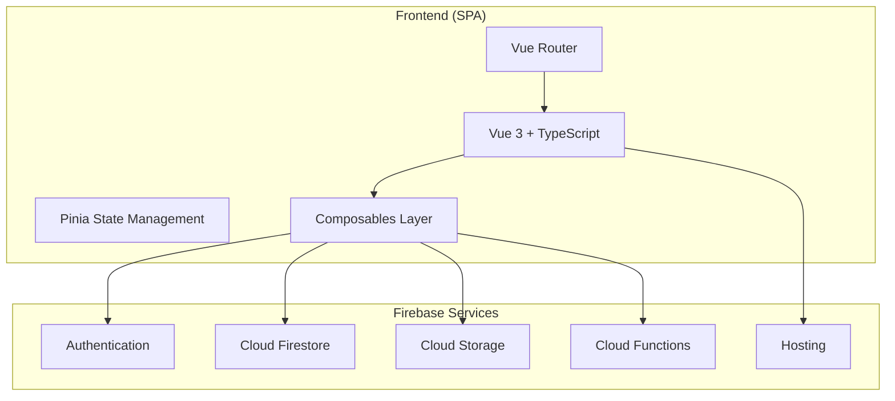

# Architecture & Development Workflow

**Stack:** Vue.js 3, TypeScript, Firebase (Firestore, Auth, Functions, Storage, Hosting)  
**AI Assistant:** Claude Code (integrated into local development)

---

## 1. High‑Level System Architecture



- **Composables layer** is the single interface between the UI and Firebase. It provides reactive wrappers for auth state, database operations, and storage uploads.
- **Pinia stores** hold globally shared state (e.g., current user, app settings) and may use composables internally.
- **Vue Router** defines lazy‑loaded routes for code splitting.

---

## 2. Project Structure

```
my-app/
├── .vscode/                # Editor configuration
├── public/                 # Static assets
├── src/
│   ├── assets/             # Styles, images
│   ├── components/         # Reusable UI components
│   ├── composables/        # Firebase abstraction (useAuth, useDocument, etc.)
│   ├── lib/                # Firebase initialisation
│   ├── router/             # Route definitions
│   ├── stores/             # Pinia stores
│   ├── types/              # Global TypeScript interfaces
│   ├── views/              # Page components
│   ├── App.vue
│   └── main.ts
├── functions/              # Cloud Functions (TypeScript)
├── firestore.rules         # Security rules
├── storage.rules
├── firebase.json           # Firebase config
├── tsconfig.json
├── vite.config.ts
├── vitest.config.ts
├── eslint.config.js
├── .prettierrc
└── CLAUDE.md               # Claude Code instructions
```

---

## 3. Development Environment

### Prerequisites
- Node.js 18 LTS
- npm or pnpm
- Firebase CLI (`npm install -g firebase-tools`)
- Claude Code CLI (`npm install -g @anthropic-ai/claude-code`)
- Git

### Setup & Emulators
1. Clone repository and install dependencies.
2. Run `firebase init` (if not already done) and enable **Emulator Suite**.
3. Start local development:
   ```bash
   firebase emulators:start --import=./emulator-data &
   npm run dev
   ```
4. The frontend automatically connects to emulators when `VITE_USE_EMULATORS=true` in `.env.local`.

---

## 4. AI‑Assisted Workflow (Claude Code)

Claude Code acts as an on‑demand pair programmer. All generated code is a **draft** that must be reviewed, tested, and manually approved.

### Typical Loop
1. **Define task** – clear requirements, component name, data model.
2. **Invoke Claude Code** with a precise prompt:
   ```
   "Create a useUserProfile composable that listens to a Firestore user document
   by ID. Include loading, error, and data refs. Follow patterns in useAuth."
   ```
3. **Automatic quality gates** – Claude Code runs linter and formatter on the changed files.
4. **Local verification**:
   - Visual check with emulators
   - `vue-tsc --noEmit`
   - `vitest run` (plus new test file if generated)
5. **Code review** – developer inspects the diff, ensures error handling, correct types, and no secrets.
6. **Commit** – only after all checks pass.

### Safety Rules
- Never generate/commit real secrets.
- Always use strict TypeScript – no `any`.
- Firebase Security Rules must be written and reviewed manually by a human.

---

## 5. Testing Strategy

### Unit Tests (Vitest)
- **Composables**: Mock Firebase SDK (e.g., `vi.mock('firebase/auth')`). Verify reactive states (loading → data/error).
- **Stores**: Test actions, getters, and their effect on the store state.
- Target: ≥80% coverage for all business logic.

### Component Tests (optional)
Use Vue Test Utils for complex conditional rendering or user interactions.

### End‑to‑End Tests (Playwright)
Critical user journeys (login, profile update, data creation) are tested against Firebase Emulators for deterministic results.

---

## 6. Security & Compliance
- **Environment variables**: All Firebase config keys are in `.env.local` (never committed).
- **Authentication**: Firebase Auth with custom claims for roles if needed.
- **No hardcoded secrets**: Code scanning (manual + automated) rejects any credential leaks.
- **Security rules** are reviewed in every PR that touches data access.

---

## 7. Monitoring (Client‑Side)
- Firebase Console for usage and performance.
- Integrate a lightweight error tracker (e.g., Sentry) via a Vue plugin.
- Firebase Performance Monitoring SDK to measure web vitals.

> **Note:** CI/CD pipelines (GitHub Actions, preview channels, production deployments) will be added in a subsequent phase. The current workflow is fully local, with manual deployment via Firebase CLI.

---

*Document version 1.0 – Maintained by the engineering team.*